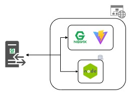

# My Web Portfolio

This repository contains the Web Portfolio for the hosted applications. The Web Portfolio is written in Vite within a NodeJS mail server. These services are designed to be integrated within a Docker Swarm instance to serve my personal web portfolio.

* [Design](#design)
* [Prerequisites](#prerequisites)
* [Usage](#usage)
* [Pre-Merge Checklist](#pre-merge-checklist)

## Design
<p align="center">
 
</p>

<br/>

This web portfolio application runs an Nginx web server to host the static files and a Nodejs to handle SMTP messages within a Docker Swarm service.

## Prerequisites
* NodeJS
* NGINX
* Vite (React)

## Usage

This web portfolio uses a NodeJS mail server which you must configured to send emails. 

* Rename `.env.config.example` to `.env.config` and update APP_PORT, SMTP_HOST values as needed

```conf
# Node applicaiton port
APP_PORT=3000

# Mail server host
SMTP_HOST=smtp.mail.yahoo.com

# Mail server port
SMTP_PORT=587
```

* Rename `.env.secret.example` to `.env.secret` and update EMAIL, EMAIL_PASS, FORWARDING_EMAIL values as needed

  ```  conf
  # Sender's email address
  EMAIL="example@yahoo.com"

  # Sender's Application Email Password
  EMAIL_PASS="mypassword"

  # Recipient's email address
  FORWARDING_EMAIL="myemail@yahoo.com"
  ```

### Running Dev Locally
1. Open a terminal shell and run `make start-server-dev`
2. Open a second terminal and run  `make start-portfolio-dev`
3. Access web portfolio via `http://localhost:4000`
4. Stop locally started app by press Ctrl + C within both terminals

### Running Docker Swarm Locally
1. Build the mock server with `make build-mock-server`
2. Start mock server with `make start-mock-server`
3. Access web portfolio via `http://localhost`
4. Stop the mock server with `make stop-mock-server`

NOTE: The above steps will simulate a remote server. An entrypoint.sh script will initialize Docker Swarm, create networks, secrets, configs, build images and start the web portfolio services. The application should be accessible via port 80.

## Pre-Merge Checklist
* Update [Portfolio VERSION](./portfolio/package.json) or [Mail Server VERSION](./mail-server/package.json)
* Update [Portfolio package.json](./portfolio/package.json) or [Mail Server package.json](./mail-server/package.json)
* Update [Porfolio CHANGELOG.md](./portfolio/CHANGELOG.md) or [Mail Server CHANGELOG.md](./mail-server/CHANGELOG.md)
