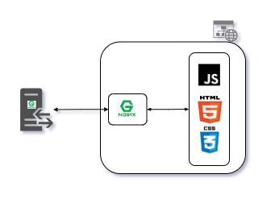

# My Web Portfolio

## Design

 

 

This web portfolio runs an Nginx web server to host the static files within a docker container. The docker-compose file is meant to be used within a docker-swarm instance.

## Usage

### Running Locally
1. `npm run build` builds the project - this builds assets, HTML, JS, and CSS into `dist`
2. `npm run serve:dist` runs the project, launches a live preview in your default browser, and watches for changes made to files in `dist`

### Running with Docker
1. `make build-image` build docker image.
2. `make run-container` runs the docker container using the docker-compose.override.yml.
3. `make destroy-container` tears down the docker container.

## Bugs and Issues

See [Bugs and Issues](bugs-&-issues.md)